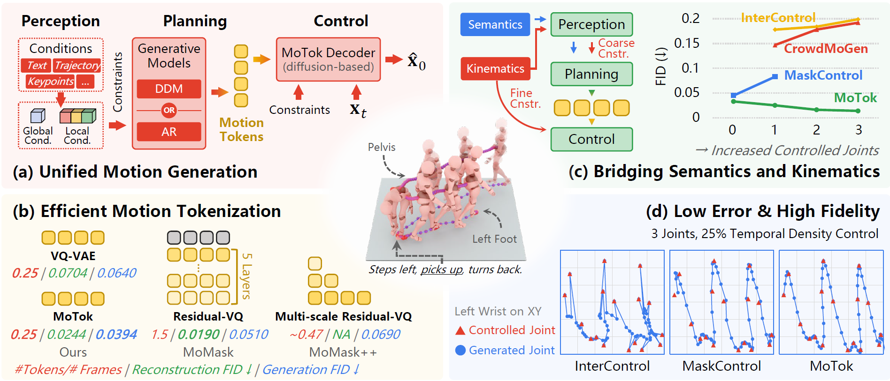

<h1>MoTok: Bridging Semantic and Kinematic Conditions with Diffusion-based Discrete Motion Tokenizer</h1>

<h4 align="center">
  <a href="https://rheallyc.github.io/projects/motok/" target='_blank'>[Project Page]</a> •
  <a href="https://www.youtube.com/watch?v=qJ92eFdUQNI" target='_blank'>[Demo Video]</a> 
  <a href="https://arxiv.org/abs/2603.19227v1" target='_blank'>[arXiv]</a> •
  <a href="https://huggingface.co/papers/2603.19227" target='_blank'>[Hugging Face Paper]</a> 
     
  
</h4>

>**Abstract:**   
Prior motion generation largely follows two paradigms: continuous diffusion models that excel at kinematic control, and discrete token-based generators that are effective for semantic conditioning. To combine their strengths, we propose a three-stage framework comprising condition feature extraction ***(Perception)***, discrete token generation ***(Planning)***, and diffusion-based motion synthesis ***(Control)***.   
Central to this framework is **MoTok**, a diffusion-based discrete motion tokenizer that decouples semantic abstraction from fine-grained reconstruction by delegating motion recovery to a diffusion decoder, enabling compact single-layer tokens while preserving motion fidelity.    
For kinematic conditions, coarse constraints guide token generation during ***planning***, while fine-grained constraints are enforced during ***control*** through diffusion-based optimization. This design prevents kinematic details from disrupting semantic token planning.    
On HumanML3D, our method significantly improves controllability and fidelity over MaskControl while using only ***one-sixth of the tokens***, reducing trajectory error from 0.72 cm to 0.08 cm and FID from 0.083 to 0.029. Unlike prior methods that degrade under stronger kinematic constraints, ours improves fidelity, reducing FID from 0.033 to 0.014.   

<tr>
    
</tr>

## Changelog🔥

- [2026/03/20] Repository created.

